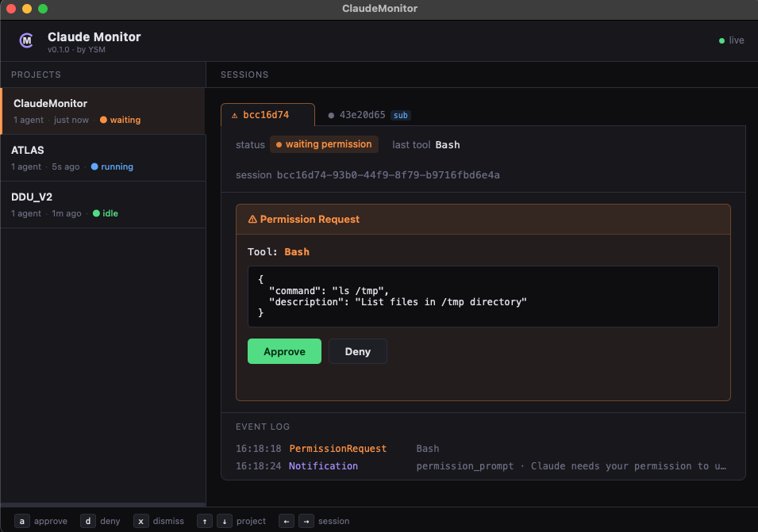
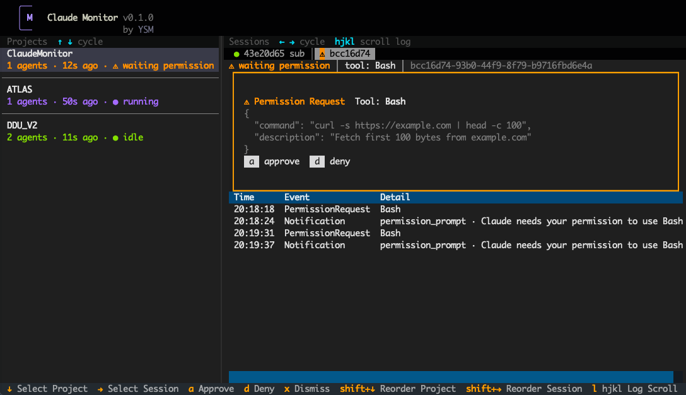

#  ClaudeMonitor

A local dashboard that monitors all active Claude Code agents on your machine.

### GUI (native window)



### TUI (terminal — works over SSH)



### Why I made this tool

I had way too many agents running. Multiple agents running in parallel within projects, many VS Code sessions, many terminal windows, all waiting for my inputs, requesting permissions, stuck in loops, etc.
So I wanted to make my own HQ to monitor all of my agents doing/not doing work.

### What this is

A lightweight Python daemon + native window that hooks into Claude Code's event system. It receives real-time events (session start/stop, tool use, permission requests, notifications) from every Claude Code session on your machine via HTTP hooks, and displays them in a single dashboard.

- **server.py** — a `ThreadingHTTPServer` on `localhost:7891` that receives hook events, tracks session state, and pushes updates via Server-Sent Events (SSE).
- **index.html** — a single-page dashboard with draggable project sidebar, per-session event logs, and inline permission controls.
- **tui.py** — a terminal dashboard (via [textual](https://textual.textualize.io/)) with the same features, usable over SSH.
- **launcher.py** — starts the server (if not already running) and opens either the native window or TUI.
- **ClaudeMonitor.app** — a macOS app bundle so you can launch it from Finder or Spotlight.

### What ClaudeMonitor can do

- Show all running Claude Code sessions grouped by project, with live status updates (running, idle, waiting for permission, ended).
- Display per-session event logs (tool calls, notifications, permission requests).
- Relay permission decisions: approve or deny tool-use requests from the dashboard instead of switching to each terminal.
- Send OS-level notifications when a session needs your attention (GUI mode).
- Track subagents and link them to parent sessions.
- Dismiss stale sessions manually from the UI.
- Drag-to-reorder project tabs (GUI) or keyboard reorder (TUI).

### What ClaudeMonitor cannot do

- It does not read or modify your code. It only sees the hook event metadata that Claude Code sends (session ID, tool name, tool input, status changes).
- It cannot start or stop Claude Code sessions — it is purely a monitor + permission relay.
- It does not work across machines by default. The daemon listens on `127.0.0.1` only (but you can use an SSH tunnel — see below).

### Installation

See **[install.md](install.md)** for a full step-by-step guide. It is written so that your own Claude Code agent can read and execute it for you:

```
cd ClaudeMonitor
claude "Read install.md and set up ClaudeMonitor for me."
```

Or manually:

```bash
git clone https://github.com/SterlingYM/ClaudeMonitor.git
cd ClaudeMonitor
pip install -e .
# configure hooks in ~/.claude/settings.json (see install.md Step 2)
```

Then launch with any of:

```bash
claudemonitor                    # native GUI window (default)
claudemonitor --inline           # terminal TUI
./run.sh                         # shell script (GUI)
open ClaudeMonitor.app           # macOS app (requires Step 4 in install.md)
python3 server.py                # server only — open http://localhost:7891 in browser
```

### Remote monitoring via SSH

If your Claude agents run on a remote machine, forward the port and run the TUI:

```bash
ssh -L 7891:127.0.0.1:7891 user@remote
claudemonitor --inline           # TUI works natively over SSH
```

Or open `http://localhost:7891` in your local browser with the tunnel active.

### Possible improvements

- Run ClaudeMonitor server on a remote machine
- Connect to Agent-based hook, notify user via channel interactively
