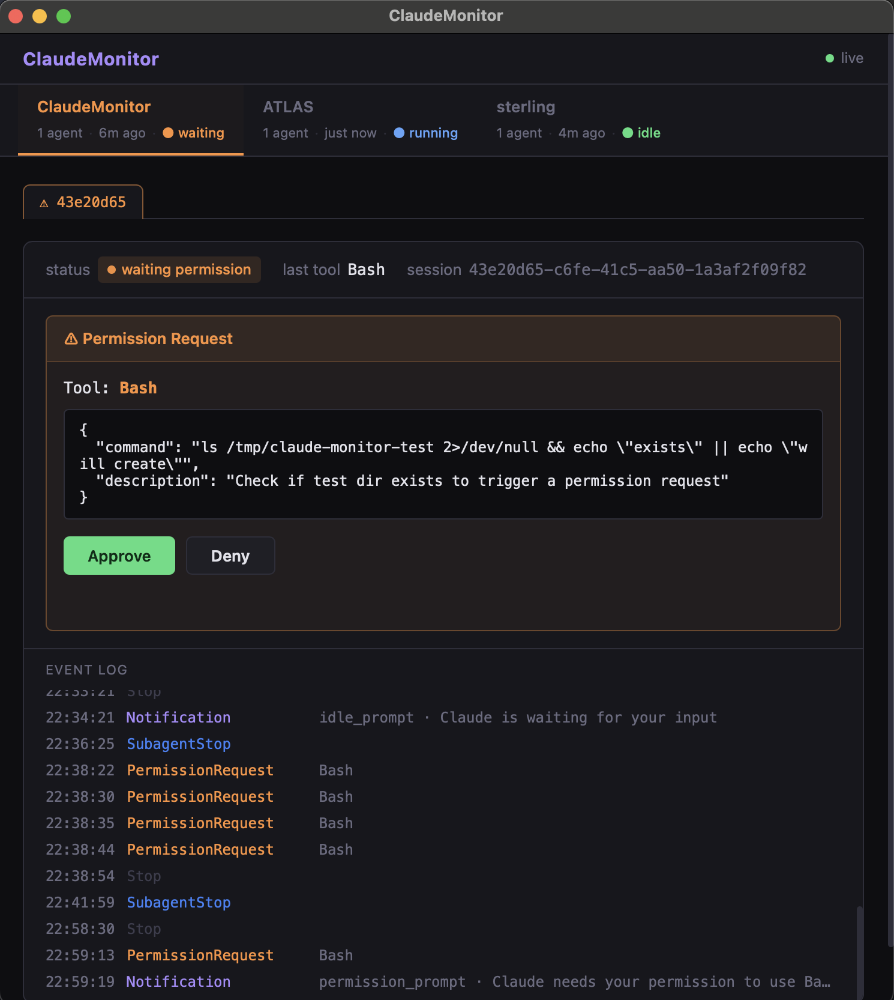

#  ClaudeMonitor

A local dashboard that monitors all active Claude Code agents on your machine.



### Why I made this tool

I had way too many agents running. Multiple agents running in parallel within projects, many VS Code sessions, many terminal windows, all waiting for my inputs, requesting permissions, stuck in loops, etc.
So I wanted to make my own HQ to monitor all of my agents doing/not doing work.

### What this is

A lightweight Python daemon + native macOS window that hooks into Claude Code's event system. It receives real-time events (session start/stop, tool use, permission requests, notifications) from every Claude Code session on your machine via HTTP hooks, and displays them in a single dashboard.

- **server.py** — a `ThreadingHTTPServer` on `localhost:7891` that receives hook events, tracks session state, and pushes updates via Server-Sent Events (SSE).
- **index.html** — a single-page dashboard with draggable project tabs, per-session event logs, and inline permission controls.
- **launcher.py** — starts the server (if not already running) and opens a native window via [pywebview](https://pywebview.flowrl.com/).
- **ClaudeMonitor.app** — a macOS app bundle so you can launch it from Finder or Spotlight.

### What ClaudeMonitor can do

- Show all running Claude Code sessions grouped by project, with live status updates (running, idle, waiting for permission, ended).
- Display per-session event logs (tool calls, notifications, permission requests).
- Relay permission decisions: approve or deny tool-use requests from the dashboard instead of switching to each terminal.
- Send OS-level notifications when a session needs your attention.
- Track subagents and link them to parent sessions.
- Auto-hide finished sessions after 5 minutes; mark silent sessions as dead after 30 minutes.

### What ClaudeMonitor cannot do

- It does not read or modify your code. It only sees the hook event metadata that Claude Code sends (session ID, tool name, tool input, status changes).
- It cannot start or stop Claude Code sessions — it is purely a monitor + permission relay.
- It does not work across machines. The daemon listens on `127.0.0.1` only.
- It is macOS-only for the native window (the web dashboard at `http://localhost:7891` works in any browser on any OS if you run `server.py` directly).

### Installation

See **[install.md](install.md)** for a step-by-step guide. It is written so that your own Claude Code agent can read and execute it for you:

```
cd ClaudeMonitor
claude "Read install.md and set up ClaudeMonitor for me."
```

Or manually:

```bash
pip install -e .                 # install pywebview
# configure hooks in ~/.claude/settings.json (see install.md Step 2)
# instantiate the .app launcher   (see install.md Step 4)
open ClaudeMonitor.app
```

### Possible improvements

- Run ClaudeMonitor server on a remote machine
- Connect to Agent-based hook, notify user via channel interactively
